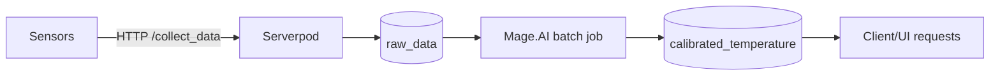

# Current Solution

## End-to-end flow

## Key behaviors
- Ingest: `collectData` endpoint upserts node and sensor, inserts into `raw_data`.
- Storage: `raw_data` indexed by `(sensorId, createdAt)` and `createdAt`.
- Calibration: Mage.AI reads uncalibrated rows, writes to `calibrated_temperature`
  (unique `rawDataId`).
- Display: API fetches latest calibrated row per sensor; ignores uncalibrated rows.
- Historical: aggregation queries use SQL bucketing for charting.

## Pain points
- Calibration is off-cluster (Mage.AI) and not event-driven.
- Potential lag between raw insert and calibration completion.
- Risk of missed calibrations if batch jobs fail.
- Limited decoupling between ingestion and calibration for scaling.

