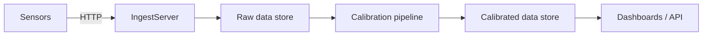

# CozyTemp – Project Overview

## What this is
- Temperature monitoring platform with multiple sensor nodes.
- Sensors emit readings every 5 seconds (currently 3 nodes, 2 sensors each).
- Goal: ingest, store raw data, calibrate reliably, and serve calibrated views.

## High-level flow (conceptual)

## Data model (today)
- `raw_data`: immutable raw readings per sensor.
- `calibrated_temperature`: one-to-one with `raw_data`, holds calibrated value.
- `sensors`, `nodes`: identities for hardware topology.

## Requirements and goals
- Keep raw data immutable for auditability.
- Always show latest calibrated values for display.
- Support recalibration of historical data.
- Detect and recover missed calibrations (e.g., Kafka/message drops).
- Run on Kubernetes; enable independent scaling and clear ownership per service.

## Tech stack (relevant pieces)
- Serverpod backend (Dart) handling ingest and API.
- PostgreSQL, recommended to enable TimescaleDB for time-series scale.
- Kafka for decoupled ingestion and calibration workloads.
- Flutter client for dashboards.

