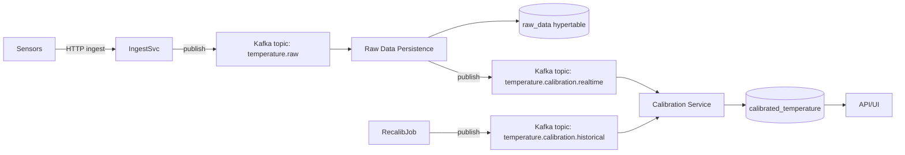

# Proposed Solution

## Goals
- Event-driven pipeline with Kafka.
- Preserve raw data; calibrate asynchronously with prioritization.
- Support recalibration/backfill without delaying new readings.
- Detect and recover uncalibrated data automatically.
- Leverage TimescaleDB for time-series scale, retention, and aggregates.

## Target architecture (high level)

## Components
- **Ingest Service (Serverpod existing)**  
  Validates and publishes sensor readings to `temperature.raw`.

- **Raw Data Persistence Service**  
  Consumes `temperature.raw`, inserts into `raw_data`, then publishes to
  `temperature.calibration.realtime`.

- **Calibration Service (single codebase, config-driven)**  
  - One image, configured per deployment with env: `KAFKA_TOPIC` and
    `KAFKA_GROUP_ID`.  
  - Deploy twice: one for realtime topic, one for historical/backfill topic.  
  - Shared calibration logic to avoid drift.  
  - Writes to `calibrated_temperature` (one-to-one on `rawDataId`).

- **Recalibration/Backfill Job**  
  Produces historical messages to `temperature.calibration.historical`
  (e.g., when calibration parameters change).

- **Reconciliation Service (CronJob)**  
  Periodically finds uncalibrated rows (e.g., createdAt older than X minutes),
  republishes to calibration topic to catch drops or Kafka misses.

- **Database (PostgreSQL + TimescaleDB)**  
  - Convert `raw_data` to hypertable on `createdAt`.  
  - Keep `calibrated_temperature` as standard table; index on
    `("rawDataId", "calibratedAt")`.  
  - Continuous aggregates for hourly/daily rollups; compression + retention on
    raw partitions.

## Calibration prioritization
- Separate topics for realtime vs historical allow independent scaling and
  strict priority.  
- Same message schema for both; routing determined by producer (new vs
  backfill).  
- Calibration service instances differ only by configured topic.

## Catching uncalibrated data
- Reconciliation CronJob queries uncalibrated rows and republishes.  
- Optionally maintain a `calibration_status` table for visibility
  (`pending`, `processing`, `completed`, `failed`).  
- Alerts on uncalibrated count or oldest uncalibrated age.

## Kubernetes mapping
- **Deployments**
  - `ingest-service` (Serverpod)
  - `raw-persistence-service`
  - `calibration-realtime` (same image, env points to realtime topic)
  - `calibration-historical` (same image, env points to historical topic)
- **CronJobs**
  - `calibration-reconciliation` (republishes uncalibrated data)
  - `recalibration-producer` (optional, scheduled backfill)
- **Jobs**
  - One-off bulk recalibration runs when triggered manually.
- **Config/Secrets**
  - Kafka brokers, DB credentials, topic names, calibration parameters via
    ConfigMap/Secret.

## Data model (unchanged structure)
- Keep two tables: `raw_data` (immutable) and `calibrated_temperature`
  (one-to-one).  
- Benefits: auditability, recalibration flexibility, and simpler queries for
  "latest calibrated" vs "uncalibrated".

## Operational notes
- Use `rawDataId` as Kafka message key for idempotency.  
- Monitor lag separately for realtime and historical topics.  
- Apply retention + compression on raw hypertable; keep aggregates longer.  
- Use continuous aggregates for dashboards instead of ad-hoc heavy queries.

